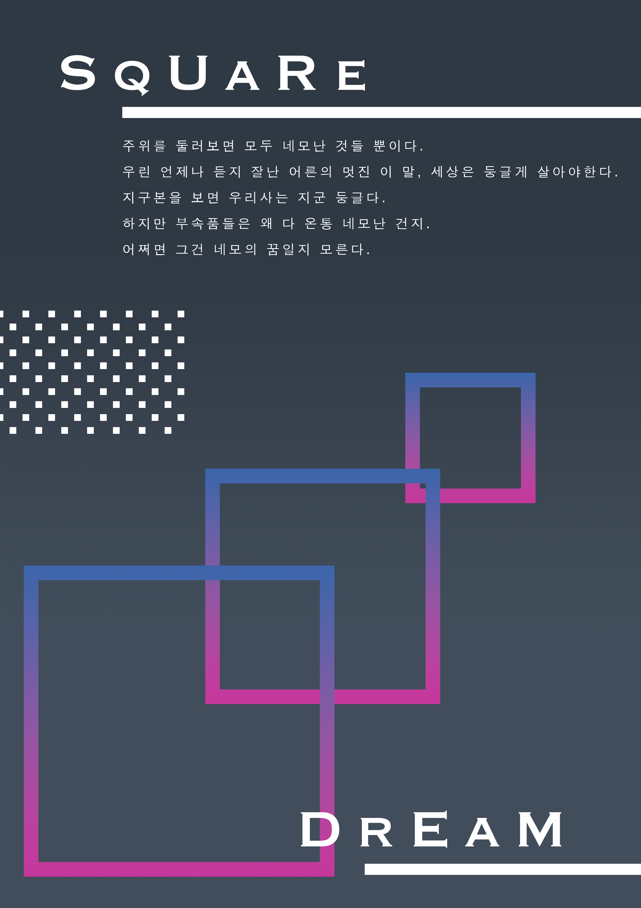
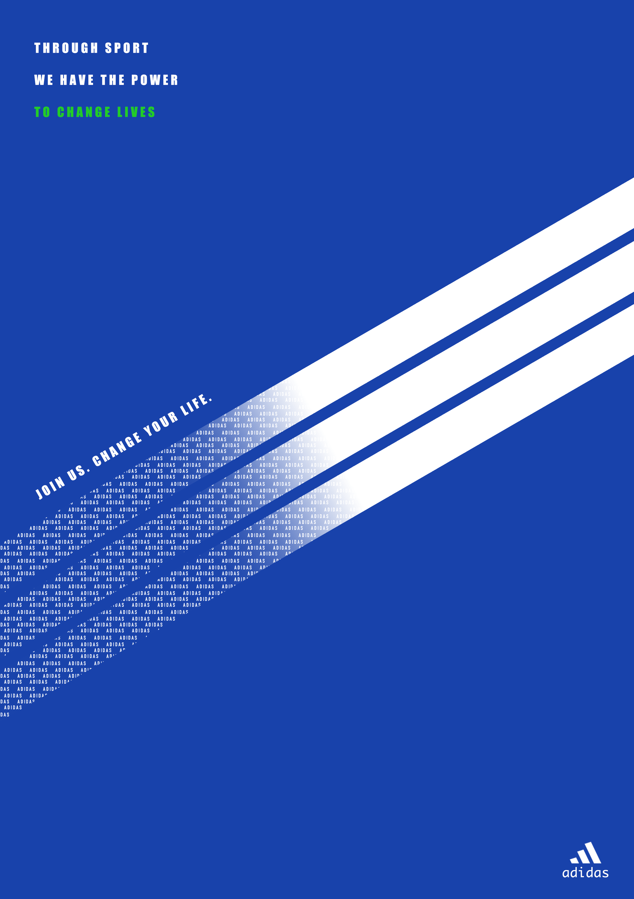
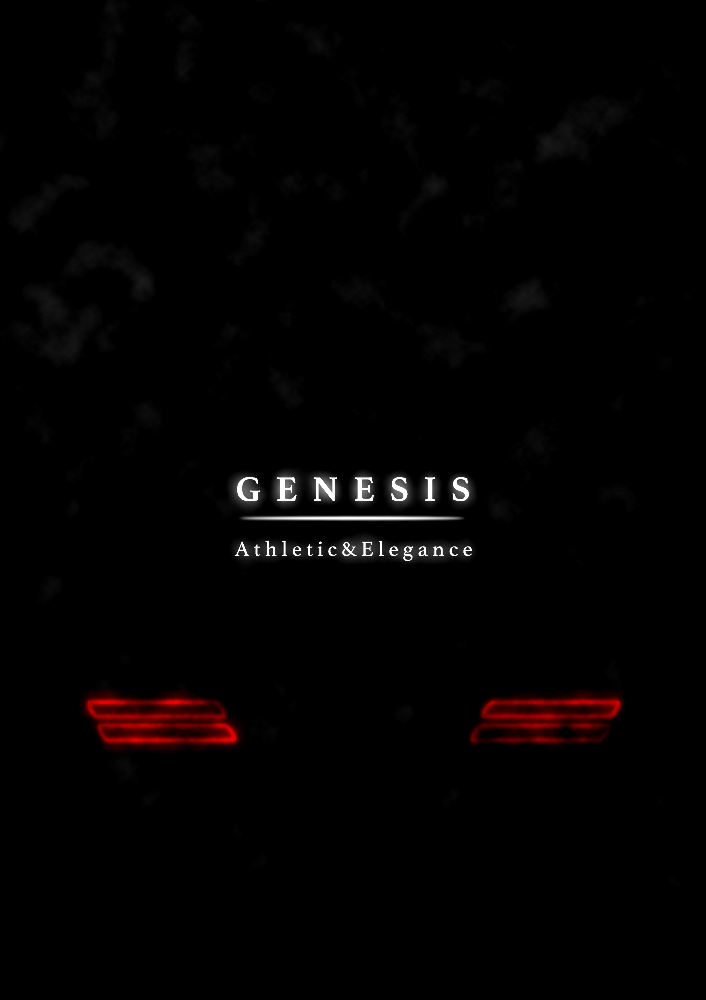

### SQURE_DREAM (2022.5.28)

포토샵 복습겸 네모의 꿈 가사를 붙여 만든 포스터입니다.

그라데이션으로 네모의 개성을, 하얀 색 네모 패턴으로 다양한 네모가 존재함을 표현했습니다.

### ADIDAS_CHANGE YOUR LIFE (2022.5.29)

아디다스의 로고와 컬러를 개인적으로 좋아해서 아디다스를 사용했습니다.

노력하면 인생이 바뀐다는 것을 그라데이션 효과로 표현했습니다.

### APPLE_THINK DIFFERENT (2022.5.29)

blend mode 사용할 겸 만든 Apple 로고와 슬로건.

Apple은 정말 완벽하다.

### POLO_BEARS (2022.5.31)

POLO의 고급스러움을 엠보싱 효과, 대리석 텍스쳐로 표현했습니다.

귀여운 곰돌이를 패턴화하고 대표적인 곰돌이 군단을 위치에 맞게 집어넣었습니다.

### STARCRAFT_RACES (2022.6.01)

어릴적부터 좋아했던 스타크래프트를 포스터로 제작했습니다.

인터넷 환경이 안좋아서 캠페인이랑 미션만 주구장창 했던 기억이 나네요.

소스는 배경이미지를 제외하곤 블리자드 공식 홈페이지에서 다운로드 받았습니다.

### CHUPACHUPS_FOREVER FUN (2022.6.02)

츄파춥스의 달콤함을 녹아있는 사탕처럼 표현했습니다.

제일 좋아하는 츄파춥스 색깔을 선택했고, 문구는 츄파춥스 홈페이지에서 가져왔습니다.

### THINKING IS DIFFICULT (2022.6.03)

생각하는 것은 어렵다.

수많은 정보 속에서 뒤척이다보니 하나의 생각에 집중하기는 정말 힘듭니다.

명상을 한다고 하더라도 수많은 잡생각에 방해를 받습니다.

로뎅의 '생각하는 사람' 동상이 연기처럼(혹은 실타래처럼) 풀린다는 상반된 느낌을 주어 하나의 생각에 집중하기 어려움을 표현했습니다.

### GENESIS_LIGHT (2022.6.05)

현대 제네시스 시리즈의 세련미를 후미등으로 표현했습니다.

필터 선택만 하루종일 고민했네요.

### DIAMOND_BRIDGE (2022.6.06)

광안대교(Diamond Bridge)를 크레용으로 그린 느낌으로 제작했습니다.

개인적으로 배경과 크레용 질감이 너무 마음에 드네요.

\+ 광안대교가 Diamond Bridge인걸 오늘 처음 알았습니다.

### SEOUL_광화문 (2022.6.08)

광화문을 배경으로 텍스트를 넣어 제작했습니다.

이미지가 커서 그런지 배경과 이질감이 조금 드네요.

### 멸종 위기 게임 (2022.6.21)

수 많은 컨텐츠와 재미를 가진 게임은 쉴틈없이 나오고 있습니다. 하지만 그 어떤 게임도 어릴적 향수를 가지고 있지는 않죠.

분주했던 오락실과 슈퍼 앞 게임기들은 시간과 함께 자취를 감췄습니다. 가끔 힘들때면 그 시절, 그 순간을 떠올리곤 합니다. 어릴적부터 게임을 좋아했기 때문에 향수를 불러일으키거든요.

"이런 것도 있었지, 얼마나 열심히 했다고"

당신의 추억 속 게임은 무엇인가요?

### 광안대교_밤과달 (2022.6.24)

해운대나 광안리를 자주 가다보니 광안대교 사진이 참 많더라고요.

광안대교 사진을 밤 느낌으로 바꾸고 달을 추가해 신비한 느낌을 줬습니다.

### OCEAN_PASTEL (2022.07.06)

수 많은 색 중에서도 파스텔 톤을 굉장히 좋아합니다. 파스텔의 바다 톤을 연필에 접목시켜봤습니다.

### QUOTES_BACKPACKER (2022.07.07)

마음에 와닿는 명언이 참 많습니다. 그중 한계, 노력에 관한 명언을 자주 찾아보곤 합니다.

그 중, Les Brown의 한계에 관한 명언이 마음에 들어서 연습을 했습니다.

한계는 결국 본인의 오판이 결정짓는 것 같네요. 나를 위해 계속 노력해야겠습니다.

### APPLE_SAFARI (2022.07.11)

사소한 것도 놓치지 않는 애플의 디테일 덕분에 애플 제품에 애정이 많이 갑니다. 
렇다보니 애플의 브라우저인 사파리를 자연스레 많이 사용합니다. 사파리를 사용하면서 느꼈던 것들을 표현해봤습니다.

---